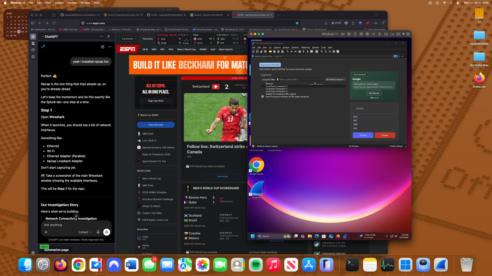
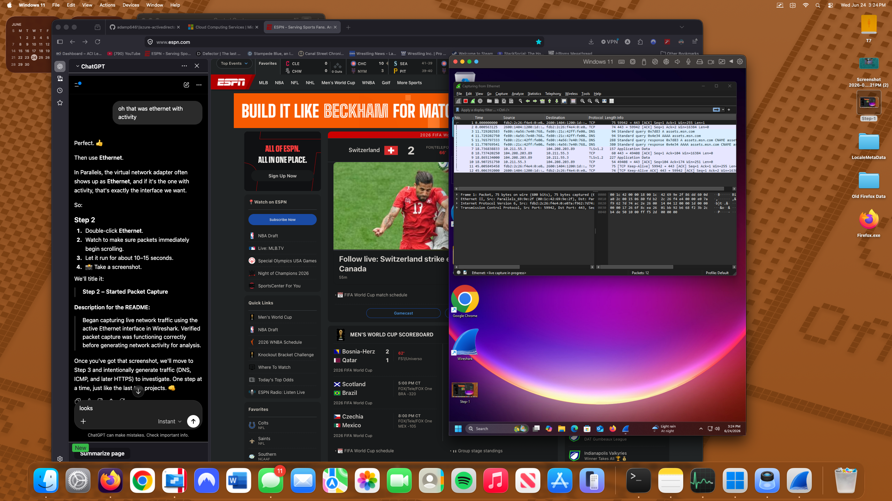
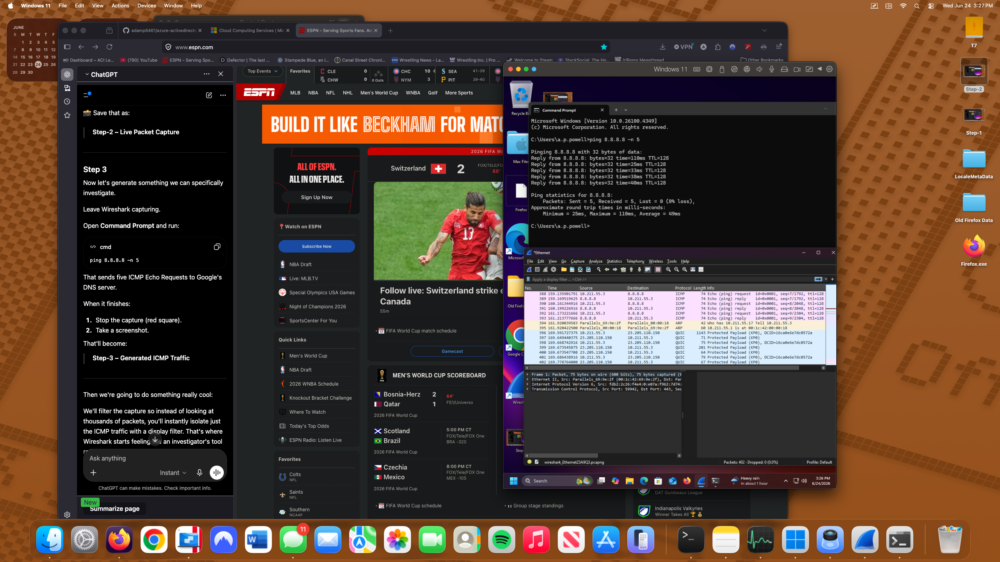
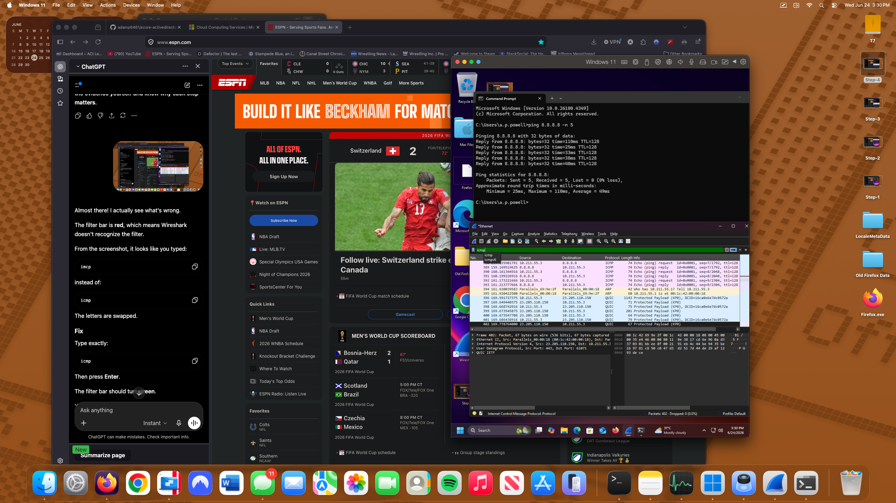
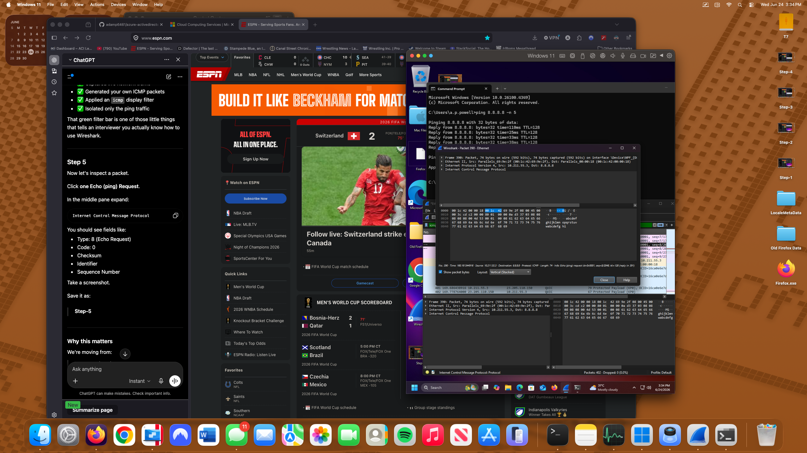
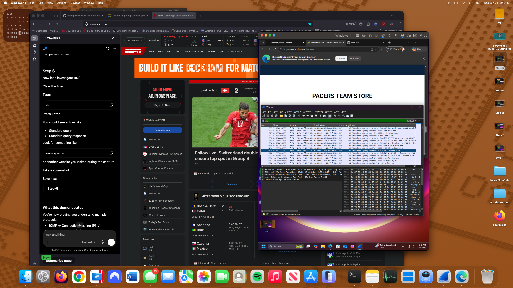
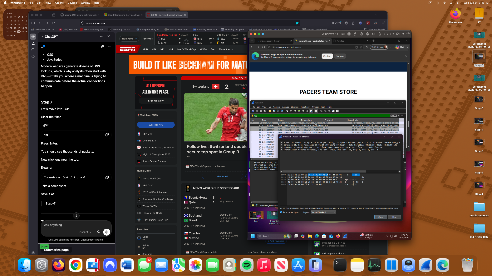
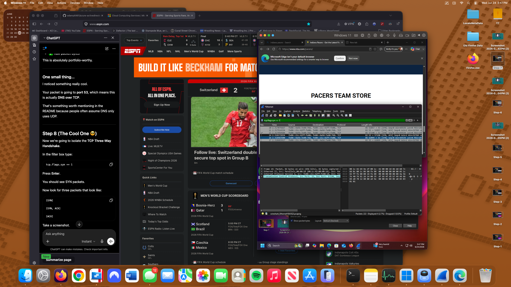

# Wireshark Network Investigation Lab

## Project Overview

This project demonstrates a network traffic investigation using Wireshark to capture, filter, and analyze common network protocols within a Windows 11 virtual machine.

Network activity was intentionally generated to simulate a typical troubleshooting scenario involving connectivity testing and web browsing. Packet captures were analyzed to identify DNS resolution, ICMP communication, TCP connection establishment, and packet-level details used during normal network operations.

The objective of this investigation was to develop practical experience analyzing packet captures while documenting findings using industry-standard network analysis techniques.

---

## Technologies Used

* Wireshark
* Npcap
* Windows 11
* Command Prompt
* TCP/IP
* DNS
* ICMP
* Transmission Control Protocol (TCP)

---

## Investigation Scenario

A user reported intermittent connectivity while attempting to access internet resources.

Network traffic was captured and analyzed to determine whether:

* DNS resolution completed successfully
* Network connectivity was functional
* TCP sessions established successfully
* Packet transmission completed without errors
* Normal network communication was observed

---

## Investigation Steps

### Step 1 – Wireshark Environment Setup

Launched Wireshark and verified available network capture interfaces.

Confirmed packet capture functionality using the active Ethernet adapter.



---

### Step 2 – Live Packet Capture

Started a live packet capture using the active Ethernet interface.

Observed live network traffic including DNS requests, TCP communication, and encrypted HTTPS traffic.



---

### Step 3 – Generate ICMP Traffic

Generated controlled ICMP traffic using the Windows `ping` command.

```cmd
ping 8.8.8.8 -n 5
```

Verified:

* 5 packets transmitted
* 5 packets received
* 0% packet loss



---

### Step 4 – ICMP Packet Filtering

Applied the Wireshark display filter:

```text
icmp
```

Isolated ICMP Echo Request and Echo Reply packets for focused analysis.



---

### Step 5 – Packet Inspection

Inspected packet-level details for an ICMP Echo Request.

Reviewed:

* Internet Protocol Version 4 (IPv4)
* Internet Control Message Protocol (ICMP)
* Destination Address
* Packet bytes (hexadecimal)
* Packet payload



---

### Step 6 – DNS Analysis

Applied the display filter:

```text
dns
```

Reviewed DNS queries and responses generated during normal web browsing.

Observed:

* Standard Queries
* Query Responses
* IPv4 (A) Records
* IPv6 (AAAA) Records
* Canonical Name (CNAME) Records



---

### Step 7 – TCP Packet Analysis

Applied the display filter:

```text
tcp
```

Inspected Transmission Control Protocol packet details including:

* Source Port
* Destination Port
* Sequence Numbers
* Acknowledgment Numbers
* TCP Flags



---

### Step 8 – TCP Three-Way Handshake

Applied the display filter:

```text
tcp.flags.syn == 1
```

Identified the TCP Three-Way Handshake used to establish a reliable network connection.

Observed sequence:

* SYN
* SYN/ACK
* ACK

This confirms successful connection establishment prior to application data transmission.



---

## Findings

The investigation confirmed normal network communication throughout the packet capture.

Evidence collected included:

* Successful DNS name resolution
* ICMP Echo Request and Echo Reply traffic
* Successful TCP Three-Way Handshake
* HTTPS communication
* Proper packet sequencing
* No observed packet loss during connectivity testing

No abnormal or malicious network activity was identified during this investigation.

---

## MITRE ATT&CK References

The following MITRE ATT&CK techniques were reviewed as part of understanding observed network behavior.

| Technique                       | ID        | Relation to Lab                            |
| ------------------------------- | --------- | ------------------------------------------ |
| Application Layer Protocol: DNS | T1071.004 | DNS traffic observed during packet capture |

### Defensive Relevance

[#defensive-relevance](#defensive-relevance)

While this investigation confirmed normal network behavior, the same protocols analyzed here are commonly abused in real-world attacks. Recognizing the baseline is what makes anomalies visible:

- **DNS Tunneling / C2 Beaconing** – Abnormally long DNS queries, high query frequency to a single domain, or unusual record types (e.g. TXT) can indicate data exfiltration or command-and-control traffic disguised as DNS.
- **ICMP Tunneling** – Oversized or irregular ICMP payloads can be used to exfiltrate data or establish covert channels, since ICMP is frequently allowed through firewalls.
- **TCP Anomalies** – Repeated SYN packets without completed handshakes (SYN floods), unexpected port usage, or RST packets immediately following SYN/ACK can indicate scanning activity or blocked exfiltration attempts.

Establishing what normal traffic looks like — as demonstrated in this lab — is a foundational skill for identifying these deviations in a production SOC environment.

---

**Note:** The network activity analyzed in this project was intentionally generated in a controlled lab environment and represents normal network behavior rather than malicious activity.

---

## Skills Demonstrated

* Packet Capture
* Network Troubleshooting
* Packet Inspection
* DNS Analysis
* ICMP Analysis
* TCP Analysis
* TCP Three-Way Handshake
* Wireshark
* Network Protocol Analysis
* Incident Documentation

---

## Author

Adam Powell

Apple Genius | CompTIA Security+ | Jamf 100 Certified

GitHub: https://github.com/adamp6461
